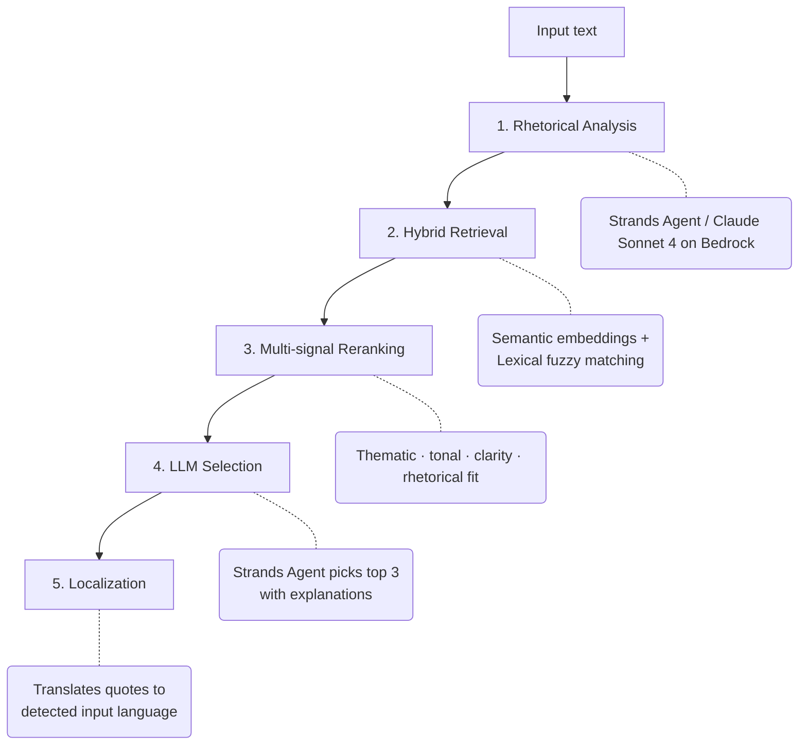

# What Homer Would Reply to Your Email: A Classical Quote Recommender with Bedrock, RAG, and Strands Agents

What if every email you write could carry the rhetorical weight of Homer? Not as a gimmick, as a real tool that understands the tone, intent, and emotion of your message and finds the classical passage that fits.

That's the idea behind this PoC: a system that takes a short text (an email, a Slack message, a reply to a tricky thread) and recommends the most fitting quote from classical literature. Right now the corpus is the Iliad and the Odyssey, nearly 5,000 passages of Homer, indexed and searchable by meaning, not just by keywords.

The interesting part isn't the concept. It's how the pieces fit together.

## The Architecture

The system runs as a FastAPI service with a five-stage pipeline:



The key idea: the two ends of the pipeline (understanding your message and choosing the final quote) use an LLM, but the middle part, finding and ranking candidates, is pure code, no AI involved. That means the core search is predictable and inspectable. Bedrock handles the parts that need language understanding; everything else stays local.

## Query Enrichment: Not Just What You Said, But What You Meant

When you search a typical RAG system, you take the user's text and look for similar documents. Here I do something different: before searching, the system enriches the query with everything it learned during the rhetorical analysis.

```python
class HybridRetriever:
    def _build_query(self, text: str, analysis: InputAnalysis) -> str:
        parts = [
            text,
            analysis.summary,
            analysis.main_theme,
            " ".join(analysis.secondary_themes),
            analysis.tone,
            analysis.intent,
            analysis.dominant_emotion,
            analysis.recommended_quote_type,
        ]
        return " ".join(part for part in parts if part).strip()
```

Say the input is *"Thanks for your feedback. I think we can find a middle ground"*. Instead of just searching for those words, the system searches for `negotiation`, `conciliatory`, `guarded optimism`, `diplomatic and bridge-building`, all at once. The search doesn't just look for passages about feedback. It looks for passages that feel the same way as the message.

## Zero-Dependency Vector Store

I deliberately avoided FAISS, Chroma, Pinecone, or any external vector database. The entire search index is a single NumPy matrix:

```python
class NumpyVectorStore:
    def search(self, query_vector: np.ndarray, top_k: int) -> list[tuple[str, float]]:
        query = np.asarray(query_vector, dtype=np.float32)
        scores = self.vectors @ query
        indices = np.argsort(scores)[::-1][:top_k]
        return [(self.ids[index], float(scores[index])) for index in indices]
```

One line does the work: `scores = self.vectors @ query`. This is a matrix multiplication that compares the query against every passage in the corpus at once. Because the embedding model produces normalized vectors, this simple operation gives you cosine similarity, a standard way to measure how close two texts are in meaning.

The full index is a matrix of 4,841 rows (one per passage) and 384 columns (one per dimension of the embedding). It loads in milliseconds and fits in memory easily. For a corpus of this size, a full-blown vector database would be overkill.

## Why all-MiniLM-L6-v2

The model that turns text into numbers (embeddings) is `all-MiniLM-L6-v2` from Sentence Transformers. It takes any piece of text and produces a list of 384 numbers that represent its meaning. Texts that say similar things end up with similar numbers, even if they use completely different words.

It's a small model, only 22 million parameters and 6 layers, but it was trained on over a billion pairs of sentences, so it's surprisingly good at capturing semantic similarity. It loads in under a second on a regular CPU and processes the entire Homer corpus in a few seconds.

There are bigger models (like `all-mpnet-base-v2` with 110M parameters) that would be slightly more precise, but for this project the bottleneck isn't the embedding quality, it's how well the query enrichment captures the intent of the message. The small model is more than enough.

## The Reranker: Five Signals, Calibrated Weights

After the search phase finds candidate passages using both meaning and keywords, a rule-based reranker scores each one across five signals:

```python
candidate.rerank_score = (
    0.45 * candidate.hybrid_score
    + 0.20 * candidate.thematic_fit
    + 0.15 * candidate.tonal_fit
    + 0.10 * candidate.clarity_fit
    + 0.10 * candidate.rhetorical_fit
)
```

Each signal measures something different: how well the topic matches, whether the tone is right, whether the passage would work rhetorically. The most product-shaped one is `clarity_fit`. It now favors excerpts that are short, sentence-bounded, and easy to paste into an email without further editing.

That matters because pure semantic similarity misses a very obvious real-world constraint: a 200-word passage from Homer might be relevant, but it's still useless if what you need is a quotable closing line.

## Strands Agents with Structured Output

The analyzer and selector use [Strands Agents](https://github.com/strands-agents/sdk-python), an open-source SDK for building AI agents. The key feature I rely on is structured output: instead of asking the LLM to return free text and then parsing it, the SDK forces the model to fill in a typed Python object directly.

```python
agent = Agent(
    model=self.model,
    system_prompt=(
        "You analyze short emails or messages for a rhetorical quote recommender. "
        "First infer the input language from the text itself. "
        "Return the detected language plus concise, grounded rhetorical analysis."
    ),
)
result = agent(prompt, structured_output_model=AnalyzerResult)
```

The `AnalyzerResult` is a Pydantic model with fields like `main_theme`, `tone`, `intent`, `dominant_emotion`, and `recommended_quote_type`. The model doesn't write prose, it fills in a form. This eliminates a whole category of bugs related to parsing LLM output.

The selector agent works the same way: it receives the ranked candidates as JSON and returns exactly three choices, each with a `why_it_fits` explanation written in the language of the original message.

## Compact Quotes, Not Paragraphs

One thing became obvious very quickly: finding a semantically relevant passage is not the same as finding a quotable one. For emails and short messages, a 70-word block of Homer is basically unusable.

So before the selector sees the candidates, the reranker extracts a compact quote window from each passage, usually one or two sentences, under 32 words. The quote still comes verbatim from the indexed corpus, but the system stops treating the full chunk as the thing you'd actually paste into an email.

That small layer makes a big difference. It biases the output toward something you can actually use without turning your message into a wall of text.

## Bedrock as the Language Brain

Language detection, rhetorical analysis, quote selection, and translation all go through AWS Bedrock (running Claude Sonnet 4). I tried a local language detector first, but short real-world messages are messy: mixed languages, ticket IDs, URLs, corporate jargon. Bedrock handles that ambiguity much better and keeps the pipeline simpler.

The deterministic part of the system is still retrieval and reranking. But for anything that requires actually understanding language, Bedrock does the heavy lifting.

## Reading EPUBs With Zero Dependencies

The corpus loader handles EPUB files using only Python's standard library, `zipfile`, `xml.etree.ElementTree`, and `html.parser`:

```python
def _load_epub(path: Path) -> LoadedDocument:
    with zipfile.ZipFile(path, "r") as archive:
        container_xml = archive.read("META-INF/container.xml")
        container_root = ET.fromstring(container_xml)
        rootfile = container_root.find(".//c:rootfile", CONTAINER_NS)

        opf_root = ET.fromstring(archive.read(opf_path))
        # Parse manifest, follow the spine, extract XHTML chapters
        for chapter_path in spine_paths:
            chapter_html = archive.read(chapter_path).decode("utf-8", errors="ignore")
            text = _extract_epub_text(chapter_html)
            chapters.append(text)
```

An EPUB is really just a ZIP file with XML and HTML inside. The loader opens the ZIP, reads the table of contents (the OPF file), follows the chapter order (the spine), and extracts clean text from each HTML chapter. No external libraries needed, just Python's built-in tools.

## The HashingEmbedder: Deterministic Tests Without Models

Running the full pipeline in tests means loading Sentence Transformers, which means downloading a 90MB model. Instead, there's a `HashingEmbedder` that produces fake-but-consistent embeddings using SHA1:

```python
class HashingEmbedder:
    def _embed(self, text: str) -> np.ndarray:
        vector = np.zeros(self.dimension, dtype=np.float32)
        for token in self._tokenize(text):
            digest = hashlib.sha1(token.encode("utf-8")).hexdigest()
            bucket = int(digest[:8], 16) % self.dimension
            sign = 1.0 if int(digest[8:10], 16) % 2 == 0 else -1.0
            vector[bucket] += sign
        norm = np.linalg.norm(vector)
        if norm > 0:
            vector /= norm
        return vector
```

The idea: each word gets hashed to a position and a direction in the vector. The same word always produces the same result, so the tests are reproducible. These embeddings don't understand meaning, "king" and "queen" won't be close, but the whole pipeline runs exactly the same way, with real numbers flowing through every step. Tests stay fast, offline, and predictable.

## Source code

Full source code available in my [GitHub repository](https://github.com/gonzalo123/nico).
